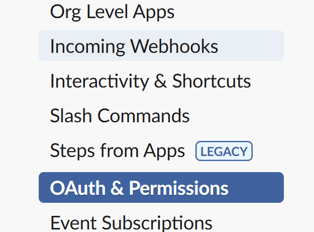
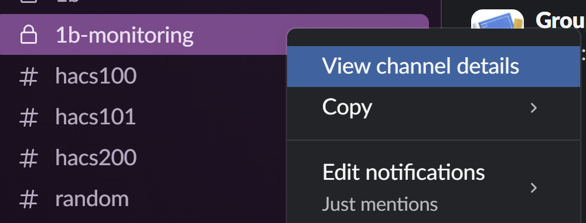

# HACS200 Slack Bot
A bot to give real time updates on honeypot status

## Usage:

`./slack.sh [CHANNEL-ID] [MESSAGE]`

e.g.

`./slack.sh C918KASJ "Test Message"`

## Installation:

### Create App

Visit: https://api.slack.com/apps and click **Create New App**

Note: you may have to make an App Configuration token as well, just click through and ignore it.

Select 'From Scratch', set the ACES Slack as your workspace, and click 'Create App'.

### Add Scopes

Once in the app, visit: OAuth and Permissions (See below).

Go to Scopes, Add an OAuth Scope, and add 'chat:write'

Scroll up and click 'Install to ACES Fall 2024 LLP Cohort'

### Create Webhook

Move to Incoming Webhooks

Click 'Add new Webhook', add the OAuth Scope (it should prompt you), and copy the url.

### Create channel

Create a new channel in Slack named whatever you want. 

Right click, view channel details, and scroll to the bottom to find the channel's ID.

### Add configuration

Create a new file in the same directory as slack.sh called 'url.env', and put the url from your webhook in there.

Add 'url.env' to your .gitignore (important)

#### You must add 'url.env' to your .gitignore

### Run

Now, you can run the script! Usage:

` ./slack.sh [CHANNEL-ID] [MESSAGE]`